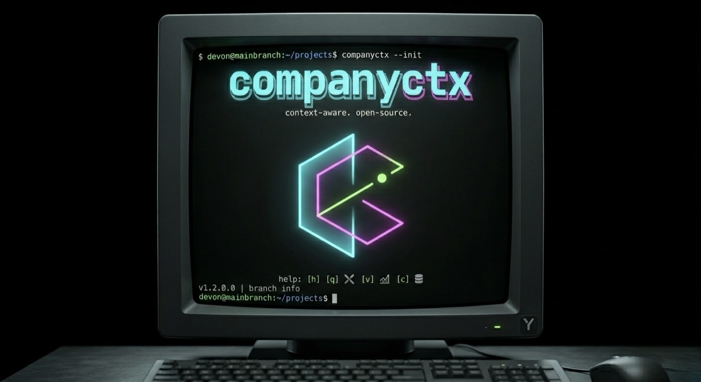

<p align="center">
  
</p>

# companyctx

**The deterministic B2B company context router. Zero keys. Schema-locked JSON your agent pipelines can actually trust.**

```bash
pipx install companyctx   # v0.4.0 on PyPI — schema_version 0.4.0, SQLite cache, FM-7 floor
companyctx fetch acme-bakery.com --json
```

```json
{
  "data": {
    "fetched_at": "2026-04-22T18:35:02.767112Z",
    "mentions": null,
    "pages": {
      "about_text": "Acme Bakery has served Portland, OR since 2010. ...",
      "homepage_text": "Acme Bakery is a bakery in Portland, OR. Founded 2010. We're a team of 3. ...",
      "services": ["Custom cakes", "Catering", "Wholesale bread", "Pastry boxes"],
      "tech_stack": ["WordPress", "Elementor"]
    },
    "reviews": null,
    "signals": null,
    "site": "acme-bakery.com",
    "social": null
  },
  "error": null,
  "provenance": {
    "site_text_trafilatura": {
      "cost_incurred": 0,
      "error": null,
      "latency_ms": 412,
      "provider_version": "0.1.0",
      "status": "ok"
    }
  },
  "schema_version": "0.4.0",
  "status": "ok"
}
```

One site in. One schema-locked JSON object out. No API keys for the
zero-key path. Graceful partials on anti-bot blocks. The envelope is
versioned via a top-level `schema_version` field so agents can branch on
shape without substring-parsing.

`reviews` / `social` / `signals` / `mentions` are reserved in the
`CompanyContext` schema; the providers that populate them (Google Places,
YouTube Data, the site-heuristic provider) are roadmap work — see
[Status](#status) below. Today a real run returns `pages.*` plus nulls,
which is what the `--mock` fixture tree reproduces byte-for-byte.

## Status

`v0.4.0` is the current release. What's shipped:

- **Envelope contract** — `{schema_version, status, data, provenance, error?}`
  with `status ∈ {ok, partial, degraded}` and a structured `EnvelopeError`
  (`{code, message, suggestion}`) on non-`ok` runs. `extra="forbid"` on every
  model. `schema_version` Literal is `"0.4.0"`. See [`docs/SCHEMA.md`](docs/SCHEMA.md).
- **Zero-key Attempt 1** — `site_text_trafilatura` (TLS-impersonated fetch
  via `curl_cffi` + trafilatura extraction). Populates `data.pages.*`
  (`homepage_text`, `about_text`, `services`, `tech_stack`). 20/20 envelope-`ok`
  on a shape-balanced zero-key probe at a fresh Chrome fingerprint; see
  [`docs/ZERO-KEY.md`](docs/ZERO-KEY.md).
- **Smart-proxy Attempt 2** — `smart_proxy_http` (vendor-agnostic URL-style
  proxy). User supplies `COMPANYCTX_SMART_PROXY_URL`; env-unset surfaces as
  `not_configured` with an actionable suggestion rather than a crash. Named-
  vendor adapter lands after the smart-proxy vendor eval (tracking: #63).
- **SQLite fetch cache (Vertical Memory wiring).** `--from-cache` /
  `--refresh` / `--no-cache` on `fetch`, plus `cache list` and
  `cache clear --site X` / `--older-than 7d`. XDG paths via
  `platformdirs`; schema-versioned migrations. `cache_corrupted` is a
  first-class `EnvelopeErrorCode`.
- **FM-7 honesty contract** — `EMPTY_RESPONSE_BYTES` raised from 64 to
  1024 (COX-52 / #91). HTTP 200 with <1024 UTF-8 bytes of extracted text
  now surfaces as `status: degraded + error.code: empty_response` instead
  of silent `ok`.
- **NXDOMAIN routed to `no_provider_succeeded`** — unresolvable hostnames
  are dead hosts, not SSRF attempts (COX-49 / #86).
- **CLI verbs** — `fetch`, `schema` (emits Draft 2020-12 JSON Schema),
  `validate`, `providers list`, `cache list`, `cache clear` (with
  `--json` where applicable).
- **`py.typed` marker + public-API re-exports** — `from companyctx import
  Envelope, EnvelopeError, CompanyContext, ...` works straight off the
  package root; downstream `mypy` sees concrete types.

What's **not** shipped yet and is explicitly deferred (the CLI surface
rejects these with a tracking-issue pointer rather than silently
accepting them):

- **`batch <csv>`** — stub, prints an error and exits non-zero. Tracked
  in #9.
- **`--config <path>` TOML loader** — stub; environment variables and
  defaults only today. Tracked in #9.
- **Direct-API (Attempt 3) providers** — Google Places (tracking: #7),
  Yelp Fusion, YouTube Data, Brave Search (mentions tracking: #58). Not
  registered today; `data.reviews` / `data.social` / `data.mentions`
  stay null on live runs until a direct-API provider lands.
- **Site-heuristic `signals` provider** — planned alongside the direct-API
  slate; populates `data.signals.copyright_year`, `last_blog_post_at`,
  `team_size_claim`.
- **`companyctx fetch --markdown`** — experimental flag labelled in help
  text; runs fail fast. Markdown output belongs in a downstream synthesis
  step, not here (tracking: #68).

Measured 97% envelope-`ok` rate on a 100-site real-world sample on the
v0.1 zero-key baseline. A 209-site partner-integration re-classification
against the v0.4 FM-7 floor
([`research/2026-04-23-cox-52-post-fix-reclassification.md`](research/2026-04-23-cox-52-post-fix-reclassification.md))
puts the post-fix FM-7 rate at 0 / 209. Full breakdown in
[`research/2026-04-21-tls-impersonation-spike.md`](research/2026-04-21-tls-impersonation-spike.md)
and [`docs/ZERO-KEY.md`](docs/ZERO-KEY.md).

Schema + CLI surface in [`docs/SPEC.md`](docs/SPEC.md) and
[`docs/SCHEMA.md`](docs/SCHEMA.md); architecture in
[`docs/ARCHITECTURE.md`](docs/ARCHITECTURE.md);
release-readiness ADR in
[`decisions/2026-04-21-v0.1.0-release-readiness.md`](decisions/2026-04-21-v0.1.0-release-readiness.md).

## What this is (and isn't)

### IS

- **A schema-locked context router.** The Pydantic v2 envelope is the
  product. Providers come and go; the contract agents consume does not.
- **A Deterministic Waterfall.** Zero-key stealth fetch first →
  smart-proxy provider (if configured) → direct-API provider (if
  configured). Every attempt returns the same shape.
- **A narrow muscle in the brains-and-muscles pattern.** Your frontier
  model is the brain; `companyctx` is one of many CLIs it pipes through.
- **A local-first memory layer.** The SQLite cache is Vertical Memory: a
  queryable local B2B dataset that compounds as a byproduct of normal
  use. Wired via `--from-cache` / `--refresh` / `--no-cache` on `fetch`
  and the `cache list` / `cache clear` subcommands. XDG paths via
  `platformdirs`; schema-versioned migrations.

### ISN'T

- **Not a scraper competing on scale.** Residential-proxy / headless-browser
  infrastructure is a commodity layer — we compose it via a
  `SmartProxyProvider` interface, we don't out-build it.
- **Not an agent framework.** Orchestration lives upstream.
- **Not a hosted service.** Local pipx CLI. No rented infra. No credits.
- **Not a synthesis engine.** Our output is the input *for* synthesis.
- **Not a Cloudflare bypass.** Zero-key covers the majority of small-biz
  homepages. It won't defeat serious anti-bot — see the
  [coverage matrix](docs/ZERO-KEY.md).
- **Not a people-data tool.** Companies only. Contact enrichment belongs
  upstream (Apollo, Clearbit, manual).
- **Not an MCP server — ever, in our roadmap.** MCP's ~50k-token schema
  dump defeats a muscle built to *save* tokens. Agents find us via
  [`SKILL.md`](SKILL.md); the CLI + `jq` + stdout are the composition
  layer. See [`decisions/2026-04-20-skill-md-not-mcp.md`](decisions/2026-04-20-skill-md-not-mcp.md).

## The Deterministic Waterfall

```
  Attempt 1 — Zero-key stealth       (TLS+HTTP/2 impersonation + trafilatura + extruct)
            ↓  403 / challenge / timeout?
  Attempt 2 — Smart-proxy provider   (user-keyed, vendor-agnostic)
            ↓  still blocked?
  Attempt 3 — Direct-API provider    (user-keyed — Google Places, Yelp Fusion, YouTube)
            ↓
  { schema_version, status, data, provenance, error? }
```

Every attempt maps to the **same** Pydantic schema. Downstream pipelines
never branch on which attempt succeeded — they branch on the envelope's
`status: ok | partial | degraded`.

On full block with no Attempt-2/3 providers configured:

```json
{
  "data": { "fetched_at": "...", "mentions": null, "pages": null, "reviews": null, "signals": null, "site": "example.com", "social": null },
  "error": {
    "code": "blocked_by_antibot",
    "message": "blocked_by_antibot (HTTP 403)",
    "suggestion": "configure a smart-proxy provider key or skip this prospect"
  },
  "provenance": { "site_text_trafilatura": { "cost_incurred": 0, "error": "blocked_by_antibot (HTTP 403)", "latency_ms": 842, "provider_version": "0.1.0", "status": "failed" } },
  "schema_version": "0.4.0",
  "status": "partial"
}
```

Never raises. Never crashes your pipeline. Every run comes back well-formed.

See [`docs/ARCHITECTURE.md`](docs/ARCHITECTURE.md) for the full picture and
[`docs/ZERO-KEY.md`](docs/ZERO-KEY.md) for honest anti-bot scoping.

## Zero-key coverage — honestly

| Site class | Zero-key outcome |
|---|---|
| Small-biz WordPress / Squarespace / Wix / Webflow / agency custom | Full payload. Measured **20/20 `status: "ok"`** on a 20-site probe across eight ICP niches at the latest Chrome fingerprint.* |
| Cloudflare Turnstile / DataDome / Akamai / PerimeterX | Clear at a fresh fingerprint; flips to `blocked_by_antibot (HTTP 403)` as the pinned fingerprint ages. Returns `status: "partial"` with actionable `suggestion`. |
| JS-heavy SPAs needing a real browser | HTML shell only. Render-dependent fields come back null. Configure a smart-proxy provider to fill the gap. |
| Aggregator pages (Yelp / Houzz / G2 / Birdeye) | Not the target — use the direct-API providers (`reviews_google_places`, `reviews_yelp_fusion`) instead. |

\* Stealth fetcher: `curl_cffi` pinned to `impersonate="chrome146"`. Spike
method, raw JSONL, and stale-fingerprint decay analysis in
[`docs/ZERO-KEY.md`](docs/ZERO-KEY.md) +
[`research/2026-04-21-tls-impersonation-spike.md`](research/2026-04-21-tls-impersonation-spike.md).
Numbers come from measurement, not marketing.

## Brains-and-muscles pipe

```bash
companyctx fetch acme-bakery.com --json \
  | jq '.data.pages | {services, tech_stack, homepage: .homepage_text[:280]}' \
  | claude -p "write a 6-section outreach brief from this context"
```

```python
import json, subprocess
ctx = json.loads(subprocess.check_output(["companyctx", "fetch", "acme-bakery.com", "--json"]))
if ctx["status"] != "ok":
    err = ctx["error"] or {}
    print(f"heads up: {err.get('code')} — {err.get('message')} → {err.get('suggestion')}")
brief = synthesize(ctx["data"])   # your synthesis call, your prompts, your weights
```

Branch on `status` (not on try/except). Branch on `error.code` (closed
enum), not on substring-matching `error.message`.

`companyctx` never calls an LLM. The brain upstream decides what the
context means.

## Install

`v0.4.0` is the current release:

```bash
pipx install companyctx
companyctx --version   # companyctx 0.4.0
companyctx fetch acme-bakery.com --mock --json
```

From source:

```bash
git clone https://github.com/dmthepm/companyctx.git
cd companyctx
pip install -e ".[dev,extract,reviews,youtube]"
companyctx --help
```

## Design invariants

- **Schema is the product.** Providers are replaceable; the
  [`CompanyContext`](docs/SCHEMA.md) envelope is not. Raw observations
  only — inference lives in the downstream synthesis layer.
- **Graceful-partial always.** Providers never raise uncaught. Every
  failure maps to `ProviderRunMetadata.status` per provider and the
  top-level `status` on the envelope.
- **Vertical Memory.** The SQLite cache compounds into a queryable local
  B2B dataset under
  [XDG paths](https://specifications.freedesktop.org/basedir-spec/) via
  the `--refresh` / `--from-cache` / `--no-cache` flags and the
  `cache list` / `cache clear` subcommands. Schema-versioned migrations
  make cache evolution explicit (see [`docs/SPEC.md`](docs/SPEC.md) §Cache).
- **Provider pluggability.** Every deterministic call class is discovered
  via Python entry points (`companyctx.providers`). Today
  `site_text_trafilatura` (zero-key) and `smart_proxy_http` (user-keyed,
  vendor-agnostic) are registered. Direct-API providers (Google Places,
  Yelp, YouTube, Brave) and the `readability-lxml` bus-factor fallback are
  scaffolded for later milestones. See
  [`docs/PROVIDERS.md`](docs/PROVIDERS.md).
- **robots.txt respected by default.** `--ignore-robots` is an explicit
  CLI-only flag; never settable via TOML or env.
- **Deterministic mocks.** `fixtures/<site>/` drives `--mock`; re-runs
  produce byte-identical output modulo `fetched_at`.

## Providers

Registered today (run `companyctx providers list` to introspect):

| Slug | Tier | Category | Key | Cost |
|---|---|---|---|---|
| `site_text_trafilatura` | zero-key | site_text | — | free |
| `smart_proxy_http` | smart-proxy | smart_proxy | `COMPANYCTX_SMART_PROXY_URL` | per-call |

Scaffolded / deferred (roadmap):

| Slug | Tier | Category | Tracking |
|---|---|---|---|
| `site_text_readability` | zero-key | site_text (fallback) | bus-factor fallback, lands alongside fallback wiring |
| `site_meta_extruct` | zero-key | site_meta | future milestone |
| `social_discovery_site` | zero-key | social_discovery | future milestone |
| `signals_site_heuristic` | zero-key | signals | future milestone |
| `reviews_google_places` | direct-api | reviews | #7 |
| `reviews_yelp_fusion` | direct-api | reviews | future milestone |
| `social_counts_youtube` | direct-api | social_counts | future milestone |
| `mentions_brave_stub` | direct-api | mentions | #58 |

Full rationale + the `SmartProxyProvider` interface in
[`docs/PROVIDERS.md`](docs/PROVIDERS.md).

## Layout

```
companyctx/            # package
  cli.py               # Typer app
  core.py              # Deterministic Waterfall orchestrator (Attempt 1 + 2)
  schema.py            # pydantic v2 models — the JSON contract
  extract.py           # HTML → SiteSignals extractor shared by zero-key + smart-proxy
  http.py              # stealth fetcher helpers
  robots.py            # robots.txt enforcement
  security.py          # SSRF + response-cap + redirect guardrails
  providers/
    __init__.py        # plugin loader (importlib.metadata.entry_points)
    base.py            # ProviderBase protocol + FetchContext + Literal category enum
    site_text_trafilatura.py    # Attempt 1 — zero-key homepage extraction
    smart_proxy_http.py         # Attempt 2 — vendor-agnostic smart proxy
    smart_proxy_base.py         # shared helpers for smart-proxy providers
SKILL.md               # ~150-token agent-discovery surface (not MCP)
docs/
  SPEC.md              # frozen spec snapshot (v0.4 envelope)
  SCHEMA.md            # Pydantic envelope in detail
  ARCHITECTURE.md      # brains-and-muscles + Deterministic Waterfall + Vertical Memory
  ZERO-KEY.md          # honest anti-bot coverage + graceful-partial contract
  PROVIDERS.md         # provider list + SmartProxyProvider interface
  VALIDATION.md        # two-phase acceptance protocol
  REFERENCES.md        # upstream OSS deps
decisions/             # in-repo ADRs (walks-the-walk for OSS readers)
fixtures/              # per-site raw HTML + expected.json (drives --mock)
tests/                 # pytest, hypothesis where useful
```

## Contributing

See [`CONTRIBUTING.md`](CONTRIBUTING.md). Conventional commits, ~400 LOC per
PR, one PR per milestone or provider. ruff + mypy strict + pytest ≥70% cov.
Architecture-shape changes go through `decisions/` first.

## Commercial Support & Custom Pipelines
`companyctx` is built and maintained by **[Noontide](https://noontide.co)**. We use it as the foundational context routing muscle for our own automated B2B outbound engines. 
If your team needs a fully managed, agentic sales pipeline (Apollo → Context Routing → LLM Synthesis → HubSpot/Outreach) but you don't have the engineering resources to build and maintain the orchestrator yourself, we can help. 
👉 **[Work with the Noontide Agency to get this built for you.](https://noontide.co)**

## License

[MIT](LICENSE). Copyright 2026 Noontide Collective LLC.

## Support

`companyctx` is open source and free to use. If it earns a place in your
pipeline, consider supporting development by joining Noontide's Main Branch
community on Skool (there's a free trial): <https://skool.com/main>.
